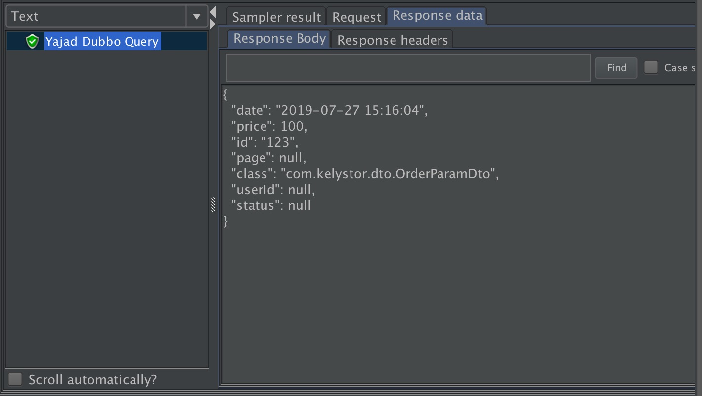

# yajad-jmeter-dubbo-plugin

YAJAD（亚加德） - Yet Another JMeter Apache Dubbo plugin

名称上来说，就是：又一个JMeter的dubbo插件

## 为什么是一个新的插件？

dubbo官方已经有一个JMeter插件（[https://github.com/dubbo/jmeter-plugins-for-apache-dubbo](https://github.com/dubbo/jmeter-plugins-for-apache-dubbo)），但在日常的使用中，发现存在诸多的不足，于是萌生了改进的念头。是基于官方的开发，然后推pull request，还是新写一个呢？

考虑了一下，还是新写一个，理由如下：

1. 官方代码版本是基于Java 7，个人已经习惯了Java 8，且Java 8也已经是一个比较古老，比较稳定，使用比较广泛的版本，不想也没必要再去兼容Java 7
2. 官方插件部分代码细节不够好，比如有的变量单词拼写错误、泛型变量没有充分应用菱形语法来简化声明、某些代码不够简洁等 ，导致IDE一直提醒，这对有强迫症的人来说，难以忍受。还有不必要的依赖，比如仅在`io.github.ningyu.jmeter.plugin.dubbo.sample.MethodArgument`中使用了`spring`框架的`StringUtils`工具类，就导致整个插件需要依赖`spring-core`包，这完全是可以避免的
3. 官方插件提供的接口传参机制不够友好，也不够强大，支持的数据类型有限，细节请参考[功能特性](#功能特性)说明
4. 部分选项不实用
	* 异步/同步的设置，不论是测试接口的性能还是功能的正确性，异步都没什么用，这种设置就是多余的
	* 列出接口列表的功能很鸡肋，真正测试的时候，接口通常会很多，会导致列表很长，很难选。虽然从插件代码上看，有自动补全机制，但实际使用似乎不生效。且真正测试的时候，因为还需要知道接口的参数，所以通常会看文档或源码，这就使得这个功能更鸡肋
5. 功能不够强大，比如没有提供默认配置元件，导致切换不同测试环境时很不方便；对dubbo版本的兼容比较弱，特别是对于dubbox这样的变种版本，需要不同的插件版本来兼容
6. 不想背负“包袱”。官方的插件讲究的是通用规范，而自己要做的更多的是满足自身的需求，不需要去考虑其他自己用不到的场景，与此同时也可以更好的实现一些自己想要的功能

## 功能特性

### 版本支持

#### Java

Java 8是必需的，插件代码是基于Java 8开发的。

#### JMeter

本插件是基于JMeter 5.0+开发的，更低版本的，如3.x，是没有测试过的，不保证能正常运行，建议使用JMeter 5.0+。

#### Dubbo

支持全系列的dubbo版本：2.5.X、2.6.X、2.7.X，包括变种版本：dubbox。

本插件是基于泛化调用的机制实现的，因此对dubbo的版本及协议有所要求，可以参考官方文档：[http://dubbo.apache.org/zh-cn/blog/dubbo-generic-invoke.html](http://dubbo.apache.org/zh-cn/blog/dubbo-generic-invoke.html)，其中有一段：

> 本文介绍的泛化调用和泛接口实现，都是在原生的 Dubbo 协议之上的。在 2.6.2 版本之前，其他协议如 http/hessian 等是不支持泛化调用的，2.6.3 版本将会对这两个协议的泛化调用做支持。

有关dubbo版本兼容的详细说明请参考：[dubbo版本兼容说明](dubbo版本兼容说明)

### 支持配置默认参数

* 注册中心连接协议
* 注册中心地址
* RPC调用协议
* 接口超时
* …………

插件提供了以上一系列通用参数的`Config Element`（类似`HTTP请求默认值`元件），各个`Sampler`不需要再重复配置，同时也可以方便的切换各种（环境）配置。

### 不需要引入接口参数所需的jar包

参数是自定义类时，本插件不需要引入对应的jar包，当然引入jar包也可以，但所对应的调用机制会有所不同，详细说明请参考：[接口jar包](接口jar包)。

### 传参使用yaml格式


#### yaml的可读性好

这点很重要，这会强制大家测试的时候，书写的参数格式都是统一美观的。

#### yaml扩展性更好

json的扩展性有限，比如如果要传递一个`Long`类型，或者新的Java 8日期对象`LocalDate`，那么官方插件使用的json格式是没办法的。官方的插件如果要扩展参数类型，就需要转变json格式，比如：

```json
{"param1": {"type": "Long", "value": 123}}
```

这样显然写起来会很烦琐。

yaml在解析上可以做一些扩展，可以支持更多的类型：

* `123L`，就表示转成`Long`类型
* `!!java.time.LocalDate 2017-05-01`表示将日期`2017-05-01`转化成`LocalDate`类型

`json`对日期的表达上不够好，特别是在没有导接口jar包的情况，这种情况下，没有类字段的类型信息，参数会被映射成`Map`，对于是否转换成`Date`类型就无法判定。更进一步，如果日期是要转成`LocalDate`呢？也是无法判定。

```java
List<FooDto> query(List<LocalDateTime> dateTimeList);
```

对于这种传参，官方的插件无能为力。

```java
List<Date> queryDate(List<Date> dateList);
```

这样的接口，也无法传参。

扩展类型的支持，可以参考[扩展类型](#扩展类型)一节。

#### yaml兼容json格式

yaml是json格式的超集，是兼容json格式的，参数同样可以用json格式书写（有细节要求，比如键值对的冒号后面要加一个空格）。但不建议用json来书写参数，原因如前面所述，json的可读性和扩展性均不如yaml。

### 输入输出更加美观

* 官方插件在输出结果信息时，没有明确设置`UTF-8`字符编码（需自行修改JMeter的配置），在某些情况下中文会有乱码。本插件对结果设置了输出编码，不需要额外的配置也能正常显示中文
* 官方插件接口传参使用的是json格式，而填写json的输入框很窄，使得json参数看起来很不明朗。本插件使用更大的输入框，且输入的参数格式为yaml，参数信息的可读性好
* 官方插件在输出接口调用结果时，没有对结果的json进行格式化，会造成查看上的不便。本插件对接口结果进行格式化输出，可以更容易查看结果
* 输出结果对日期进行格式化，更便于查看



### sampler时间优化

不计算起始的连接时间（如连接zookeeper），以接口真正调用的时间开始计算，有利于测试接口的响应速度。

## 使用

下载相应依赖的jar包（可以在[dist](dist)目录下载），放到JMeter的`lib/ext`目录。

以下所列jar包，是以JMeter 5.0+为基础，如果不是此版本的JMeter，可能会有所出入。

### 依赖的jar包

* curator-client-2.12.0.jar
* curator-framework-2.12.0.jar
* curator-recipes-2.12.0.jar
* gson-2.6.1.jar
* guava-16.0.1.jar
* javassist-3.15.0-GA.jar
* jline-0.9.94.jar
* log4j-over-slf4j-1.7.5.jar
* netty-3.7.0.Final.jar
* netty-all-4.1.25.Final.jar
* snakeyaml-engine-1.0.jar
* zkclient-0.1.jar
* zookeeper-3.4.14.jar

### jar包说明

* jar包的版本并不绝对，也可以尝试使用更高或者更低版本，以上只是参考
* 如果有使用过官方的插件，应该具有依赖所需的大部分jar包了，只需额外下载`snakeyaml-engine-1.0.jar`即可
* 以上部分jar包，只有dubbo 2.7.X才需要，这里就不细致区分了，建议全部下载
* 除了以上的依赖包，还需要dubbo本身的jar包。JMeter中所使用的dubbo包最好和服务端保持一致，由于各自测试的系统有所差别，这里就不提供dubbo的jar包下载，请自行向服务端的开发人员索要
* 如果需要其他序列化方式，如`kryo`，请自行再放入所需的jar包

### dubbo版本兼容说明

从2.7版本开始，dubbo属于apache顶级项目，包名也发生了变化，给版本的兼容带来了一些麻烦。尤其是对于dubbox这样的变种版本，为了做到兼容各种dubbo版本，本插件做了比较特别的编译处理。

通常来说，只要JMeter中使用的dubbo的jar包版本和服务端一致就可以。但本插件不支持同时测试两种不同体系dubbo版本的服务端。如果测试的服务端是标准版的不同版本（如一个是2.6.X，一个是2.7.X），那么是可以支持的（因为标准版的dubbo高低版本是可以兼容的）。但如果测试的服务端既有标准版的，又有dubbox这样的变种版本，那么是不支持。因为dubbox的jar包和标准版的jar包并不完全兼容，而插件本身同时只允许使用一个dubbo的jar包，所以无法同时支持。如果既要测dubbox，又要测标准版的dubbo，那么建议使用两套JMeter，各自测试不同的版本。

dubbo版本兼容并没有严格的测试，如果发现有不兼容的情况，请提issue。

### 插件jar包

下载好依赖的jar包后，到[releases](releases)页面下载插件的jar包，同样放到JMeter的`lib/ext`目录。

以后插件版本升级，如无特别说明，只需从[releases](releases)页面下载最新的jar包放到JMeter的`lib/ext`目录，并删除`lib/ext`目录中老版本的插件jar包即可。

### 接口jar包

不论是否引入接口jar包，本插件都提供了支持，但两者的机制有所不同。不引入接口jar包时，接口参数如果是自定义类型，会被映射成`Map`类型。而引入jar包时，因为jar包中包含了对应的类，则会映射成具体的类型。

但建议优先使用不引入接口jar包的方式，理由如下：

* 引入jar包，相当于增加了额外的步骤，有时查找获取jar包也是件麻烦的事情，增加了额外的工作量
* 引入jar包，也意味着需要定期去更新jar包，特别是对于类新增的字段，如果不更新jar包，新的字段将无法传递到服务端
* 引入jar包，对应的参数会映射成具体的实现类，本插件中，是使用json方式来转换成对应的类实例，json方式的表达能力较为有限，这可能会导致一些类型的丢失，特别是`扩展类型`（请参考[扩展类型](#扩展类型)一节）

一定要使用接口jar包就只有一种情况，那就是版本兼容。比如使用的是dubbox这样的变种版本（不幸的是，本人公司正好用的是这样的变种版本-_-），dubbox的序列化机制，会导致没有提供`setter`方法的自定义类，无法对`private`字段赋值（标准版的dubbo是可以的）。如下面的类：

```java
public class Page implements Serializable {
	private int row;
	private int page;

	public Page(int row, int page) {
		this.row = row;
		this.page = page;
	}
}
```

如果不引入接口jar包，插件会以`Map`的方式传递参数，服务端在反序列化时，无法将值赋给`private`字段，导致服务端收到的参数值是无效的。如果是引入jar包，则插件会以具体类实例的方式传递参数，服务端可以正常反序列化。

### 配置元件

在对dubbo接口进行测试之前，建议先创建一个配置元件。配置元件的配置相当于默认配置，后续的`Sampler`如无具体配置，则会使用此元件的配置。

`Config Element` → `Yajad Dubbo Defaults`


各个配置项都对应dubbo相关的参数，如不清楚，请先自行了解dubbo或者向服务端开发人员咨询，这里不再赘述。通常情况下，只需要配置`Registry Address`及`Registry Protocol`（直连选择`none`）即可。

### dubbo接口测试

添加相应的`Sampler`进行测试：`Sampler` → `Yajad Dubbo Sampler`


`Sampler`中的配置项如果与配置元件相同，则留空即可，不同则自行填写。`Sampler`中最主要的有以下三项：

* `Interface`：对应要测试的接口
* `Method`：对应要测试的接口方法
* `Parameter`：对应要测试的接口方法参数

`Interface`和`Method`都很简单明了，`Parameter`项比较复杂，本插件使用了yaml来表示参数，可读性更好，也更有扩展性，详细使用请参考下面的说明。

### 参数yaml示例

yaml是json的超集，即参数也可以使用json格式来表示。如果有使用过官方的插件，可以直接进行转换。官方插件是使用每行一个`paramType`和`paramValue`来表示参数，假设填写了3个参数（3行），则可以按以下格式来转换：

```json
[
  {"paramType1": paramValue1的内容},
  {"paramType2": paramValue2的内容},
  {"paramType3": paramValue3的内容}
]
```

**注意`paramValue`如果是字符串，要加上`"`。**

当然，更推荐使用yaml来表示参数。

#### 基本写法

yaml使用`-`来表示列表，每行对应一个参数：

```yaml
- 类型名: 类型值
- 类型名: 类型值
- 类型名: 类型值
```

类型名是用于确定要调用哪个方法，如果有学过Java的同学，就会知道这其实跟通过反射来动态调用类方法原理是一样的。假设有一个类方法签名为：

```java
class OrderService {
    boolean submit(Integer userId, String orderNo) {
        return true;
    }
}
```

则对应的反射调用代码：

```java
Method method = OrderService.class.getMethod("submit", Integer.class, String.class);
method.invoke(object, args);
```

可以看到要调用某个方法，必须指明方法的参数类型，因此这里用yaml来表达参数时，必须要有`类型名`和`类型值`。`类型名`用于确定要调用的方法，等价于上例中的`Integer.class, String.class`；`类型值`用于给方法传参，等价于上例中的`args`。

还是以`OrderService#submit`为例，则对应的参数yaml可以写成：

```yaml
- java.lang.Integer: 1
- java.lang.String: test
```

表示第一个参数为整型，第二个参数为字符串，正好对应`submit`方法的参数类型。

#### 值隐式类型

yaml中提供了多种隐式类型（或者可以称为常量结构），包括：整数、浮点数、字符串、null、布尔。以下为常量的基本使用示例：

```yaml
boolean: 
    - TRUE  #true,True都可以
    - FALSE  #false，False都可以
float:
    - 3.14
    - 6.8523015e+5  #可以使用科学计数法
int:
    - 123
null:
    name: ~  #使用~表示null
    age: null #使用null表示null
    sex: #不写任何东西表示null
string:
    - 哈哈
    - 'Hello world'  #可以使用双引号或者单引号包裹特殊字符
    - "123"	#字符串的123，而非数字123
```

如果可以通过值来推断出类型，则可以使用隐式类型的写法，如上节的参数示例可以简化为：

```yaml
- 1
- test
```

第1个参数只写了类型值`1`，对应的隐式类型为`Integer`，第2个参数只写了类型值`test`，对应的隐式类型为`String`。正好可以对应`submit`方法的参数类型，因此这里可以省略`类型名`，只写`类型值`。

**注意：整数本身其实不完全对应`Integer`类型，而是会根据整数值的大小自动选择类型，如`Long`、`BigInteger`。**

#### 值显式类型

有时需要明确指明值为某种类型，可以使用`!!`来显式的表示类型：

```yaml
- !!float 54321
- !!str 54321
- !!str true
```

如上例的`543211`，如果不加显式类型，则会转为`Integer`，同理`true`不加显式类型会转为`Boolean`，加上显式类型，则都转化对应的类型。

`int`、`float`、`bool`、`null`、`str`这几个是自带的显式类型，除此之外，本插件还扩展定义了其他的类型，如`long`、`date`、`java.time.LocalDate`等，请参见“[扩展类型](#扩展类型)”一节。

#### 类型名缩写

本插件提供了一些常用类型的名称缩写：

缩写 | 对应的Java类型
| :-- | :--
int | Integer |
string | String |
str | String |
double | Double |
short | Short |
float | Float |
long | Long |
byte | Byte |
bool | Boolean |
boolean | Boolean |
char | Character |
List | java.util.List |
list | java.util.List |
Set | java.util.Set |
set | java.util.Set |
Map | java.util.Map |
map | java.util.Map |

在写参数时，可以使用这些缩写，如：

```yaml
- int: 123
- float: 1.2
```

这里再次强调，类型名是为了确定要调用的方法，一定要明确（否则调用不到方法）。前面说过，类型名可以由值来推断，这只适合值对应的类型刚好完全对应要调用的方法参数类型，实际中，这两者可能是不对应的。

```yaml
- long: 123
```

这里写的接口参数类型是`long`，但传入的值`123`实际上是`Integer`类型（通常dubbo底层调用机制是会自动将`Integer`转为`Long`的）。

再看一个例子：

```java
void reserve(List<Integer> seatIds);
```

这时，参数如果写成：

```yaml
- [1, 2, 3]
```

会造成方法调用失败。因为虽然`[1, 2, 3]`这样的值也是`List`类型，但其实际类型是`List`类型的子类`ArrayList`。如果这样写，则实际调用的方法为：

```java
void reserve(ArrayList<Integer> seatIds);
```

显然这个方法是不存在的，应改为：

```yaml
- list: [1, 2, 3]
```

加上`list`后，对应的类型声明就变成了`List`（值仍然是`ArrayList`），就可以正确调用到方法了。

#### 复杂类型

复杂类型是指参数为自定义类，在yaml使用`map`来表示这种类型。`map`的写法为`:`分隔的键值对，每行一个。

假设要调用的接口方法声明如下：

```java
interface OrderService {
    OrderParamDto query(OrderParamDto orderParamDto, Page page, Integer userId);
}
```

`OrderParamDto`类定义：

```java
public class OrderParamDto {
    private String id;
    private Integer price;
    private Long userId;
    private Page page;
    private OrderStatus status;
    // 省略getter/setter
}

public enum OrderStatus {
    ORDER(0),
    PAID(1),
    CANCEL(2),
    FINISH(3);

    private int code;

    OrderStatus(int code) {
        this.code = code;
    }

    public int getCode() {
        return code;
    }
}

public class Page {
    private int page;
    private int rows;
    private List<Sort> sort;
    // 省略getter/setter
}

public class Sort {
    private String field;
    private String order;
    // 省略getter/setter
}
```

参数示例：

```yaml
- com.yajad.dto.OrderParamDto:
    id: "123"
    price: 100
    status: CANCEL
- com.yajad.dto.Page:
    page: 1
    rows: 2
    sort:
    - 
      field: name3
      order: desc
    - 
      field: name5
      order: asc
- 123
```

* 参数是自定义类型时，字段缩进要多一层（4个空格）
* `status`为枚举类型，可以使用枚举值对应的字面量字符串来表示

#### 扩展类型

官方插件因为使用json来表示参数，在值类型的支持上不尽人意。例如日期类型很难写（没找到怎么写，尤其是在不导接口jar包调用方法的情况）、不支持`LocalDate`、`BigDecimal`等类型。

本插件之所以选择yaml来表示参数，很大的一个原因就是yaml的可扩展性，可以自行扩展支持新的类型。

##### Long类型

长整型在数字后面加`L`或`l`即可，如：`123L`，也可以使用`!!long`来声明。如：

```yaml
- 123L
- !!long 123
```

##### 日期类型

日期类型使用`年-月-日`格式，如果包含时间，则使用`年-月-日 时:分:秒`格式：

```yaml
- 2019-05-01
- !!date 2019-05-01
- 2019-05-01 12:00:01
- !!java.time.LocalDate 2019-05-01
- !!java.time.LocalDateTime 2019-05-01 12:01:02
```

前3个会转化为`Date`类型，后2个则转化为对应的`LocalDate`和`LocalDateTime`类型。

##### 其他类型

`!!`可以直接使用Java类型，支持有静态方法`valueOf`的类或构造方法可以传`String`参数的类进行实例化，如：

```yaml
- !!java.lang.Float 2019
- !!java.math.BigDecimal 100.05
```

这种写法，相当于Java代码：

```java
Float.valueOf("2019");
new BigDecimal("100.05");
```

**对于`java.lang`包下的类，可以只写类名，如：**

```yaml
- !!Float 2019
```

#### 数组类型

数组类型不论是类型名，还是类型值，只要在类型后面加上`[]`即可，如：

```yaml
- int[]: [1,2,3]
- Number[]: [1,2,3]
- !!int[] [1,2,3]
- !!java.math.BigDecimal[]
  - !!java.math.BigDecimal 1.1
  - !!java.math.BigDecimal 2.2
  - !!java.math.BigDecimal 3.3
```

**注意：目前只支持一维数组，多维数组实际使用非常少，暂不考虑**

#### json支持

由于yaml是json的超集，因此参数也可以直接用json格式来表达，甚至可以混合使用。

```yaml
- com.yajad.dto.OrderParamDto:
    id: '38'
    price: 100
    page:
      page: 1
      rows: 10
      sort:
        field: name
        order: desc
- com.yajad.dto.User:
    id: 38
    name: test
```

可以直接写成json：

```json
[
  {
    "com.yajad.dto.OrderParamDto": {
      "id": "38",
      "price": 100,
      "page": {
        "page": 1,
        "rows": 10,
        "sort": {
          "field": "name",
          "order": "desc"
        }
      }
    }
  },
  {
    "com.yajad.dto.User": {
      "id": 38,
      "name": "test"
    }
  }
]
```

混合写法：

```yaml
- com.yajad.dto.OrderParamDto:
    id: '38'
    price: 100
    page:
      page: 1
      rows: 10
      sort:
        field: name
        order: desc
- com.yajad.dto.User: {id: 38, name: "test"}
```

混合写法，注意属性和值之间要有一个空格。如上例的，`name`属性和值`test`之间有一个空格。

虽然yaml支持json，但还是建议用yaml来书写参数，会有更好的可读性。为了兼顾习惯json的同学，插件提供了一个转换功能，可以将json格式转换为yaml格式。只需点击参数输入框左下角的`json to yaml`按钮即可转换，注意输入的json中不要含有JMeter变量，否则会被视为不合法的json，将无法转换（可以先将变量写成常量，转换后再写回成变量）。

**注意：如果使用json写法，则无法使用`扩展类型`，这也是推荐使用yaml来写参数的一个原因。**

#### null值

```yaml
- java.lang.Integer: null
- org.apache.commons.lang3.StringUtils: null
- float: null
- Double: null
- str:
```

类型值写成`null`即表示`null`值，也可以不写，如上面例子中的`str:`，表示类型是字符串，值是null。

#### 无参数

如果要调用的接口方法不需要传参，那么将参数输入框留空即可。

#### 参考

更多yaml的相关语法，请参考：

* [https://www.jianshu.com/p/97222440cd08](https://www.jianshu.com/p/97222440cd08)
* [https://yaml.org/spec/1.2/spec.html](https://yaml.org/spec/1.2/spec.html)

## 问题反馈

如有问题请提issue